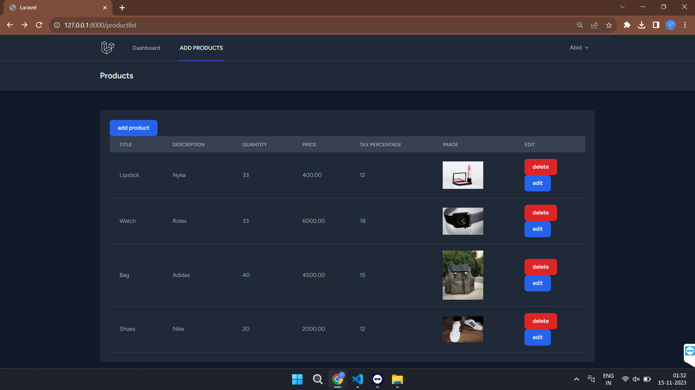
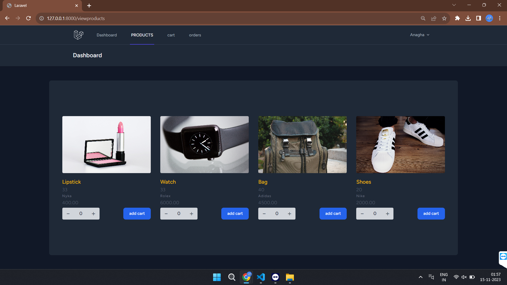
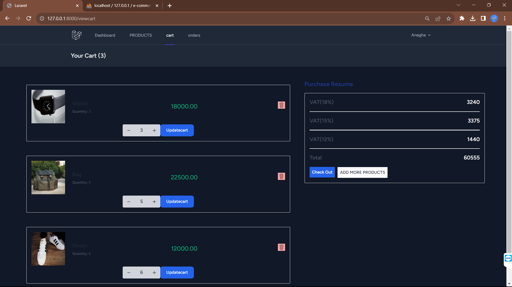
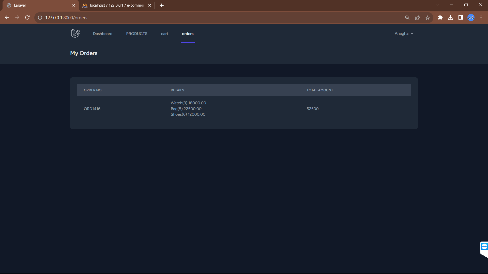

 <h1 align="center">E-commerce Website</h1>

<h3>Project Description</h3>

Developed a Laravel-based e-commerce website featuring a mailing system, CRUD operations, and database relationships. Administrators can easily manage products, while users enjoy a seamless shopping experience with functions like adding to cart and checkout. The platform ensures efficient communication through Laravel's mailing system, providing order confirmations and updates. This project highlights Laravel's adaptability in crafting a user-friendly and feature-rich e-commerce solution.

